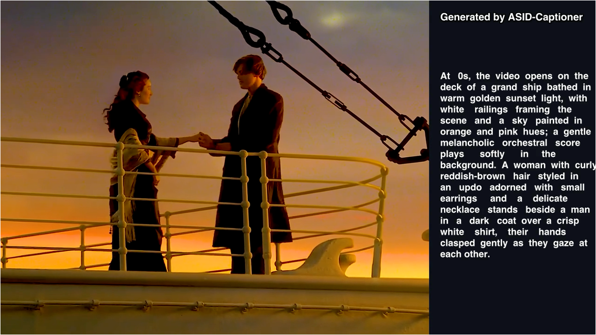
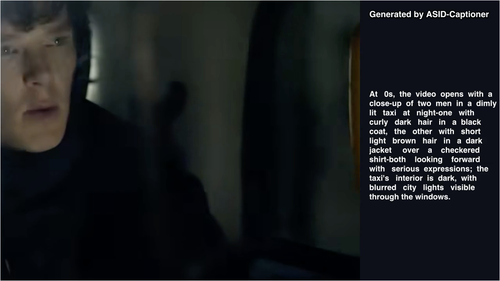
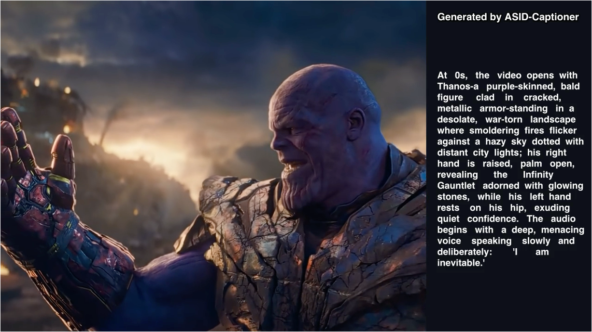
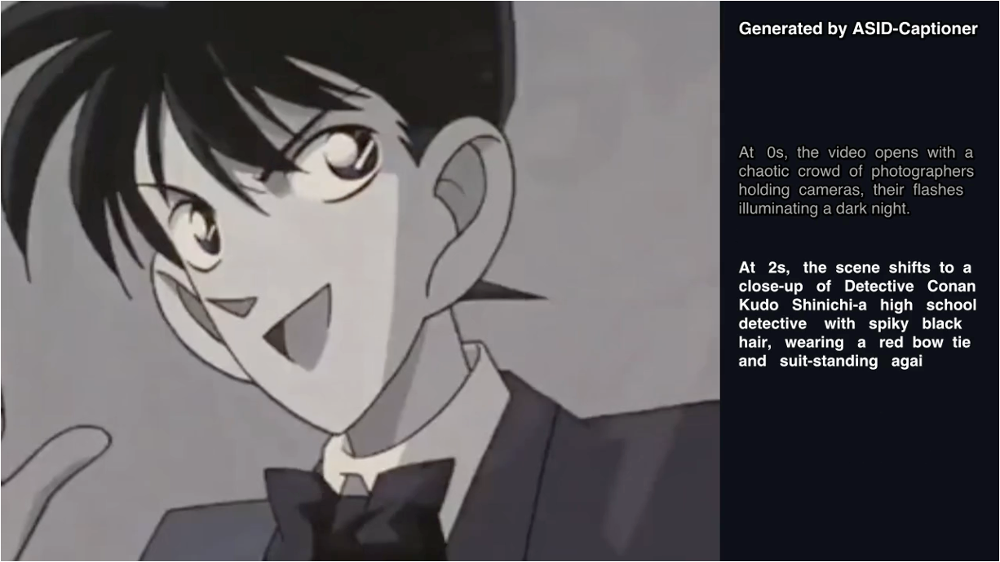
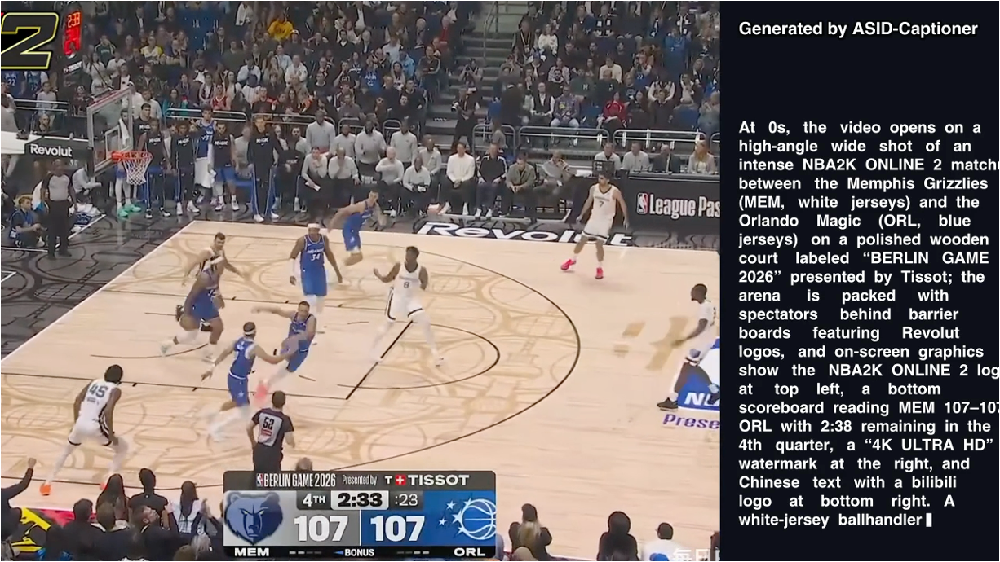
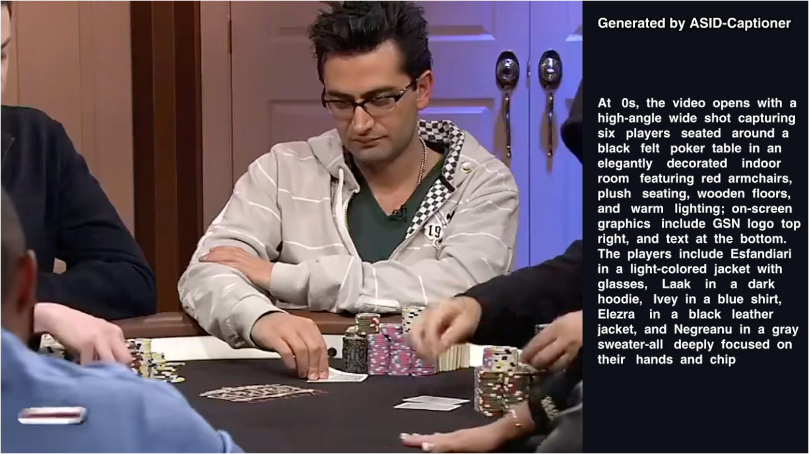

<div align="center">

<h1>ASID-Caption: Towards Universal Video MLLMs with Attribute-Structured and Quality-Verified Instructions</h1>


[**Yunheng Li**](https://lyhisme.github.io/)<sup>1</sup> · [**Hengrui Zhang**](https://zhenrys.github.io/)<sup>1</sup> · [**Meng-Hao Guo**](https://menghaoguo.github.io/)<sup>3</sup> · [**Wenzhao Gao**]()<sup>2</sup> · [**Shaoyong Jia**]()<sup>2</sup> · [**Shaohui Jiao**]()<sup>2</sup> ·[**Qibin Hou**](https://houqb.github.io/)<sup>1&dagger;</sup> · [**Mingming Cheng**](https://mmcheng.net/)<sup>1</sup> 

<sup>1</sup>VCIP, Nankai University  <sup>2</sup> ByteDance Inc. <sup>3</sup> Tsinghua University 

&dagger;Corresponding author


<a href="https://arxiv.org/pdf/2602.13013"></a>
<a href="https://asid-caption.github.io//"></a>
<a href='https://huggingface.co/datasets/AudioVisual-Caption/ASID-1M'></a>
<a href='https://huggingface.co/AudioVisual-Caption'></a>

</div>

---

## ✨ Overview
Existing video instruction datasets often treat each video as a single unstructured caption, which leads to incomplete descriptions and makes it hard to learn controllable, fine-grained understanding. Simply making captions longer can introduce more hallucinations without systematic verification.

Our key idea is to provide attribute-structured supervision and verify each attribute against audiovisual evidence, enabling more reliable fine-grained learning.

## 🎬 Captioning Case of ASID-Caption

<div align="center">

<div style="display: flex; gap: 10px; justify-content: center; margin-bottom: 20px;">
  <a href="https://asid-caption.github.io/Homepage/images/titanic.mp4">
    
  </a>
  <a href="https://asid-caption.github.io/Homepage/images/sherlock.mp4">
    
  </a>
</div>

<div style="display: flex; gap: 10px; justify-content: center; margin-bottom: 20px;">
  <a href="https://asid-caption.github.io/Homepage/images/ironman4k.mp4">
    
  </a>
  <a href="https://asid-caption.github.io/Homepage/images/KeNanStart.mp4">
    
  </a>
</div>

<div style="display: flex; gap: 10px; justify-content: center; margin-bottom: 20px;">
  <a href="https://asid-caption.github.io/Homepage/images/NBAslam30s.mp4">
    
  </a>
  <a href="https://asid-caption.github.io/Homepage/images/poker.mp4">
    
  </a>
</div>

</div>

## 🚀 Getting Started

## 1. Clone the repository
First, clone the project and navigate into the directory:

```bash
git clone https://github.com/HVision-NKU/ASID-Caption.git
cd ASID-Caption
```

## 2. Set Up the Environment

Requires **Python 3.11** (pre-installed).

### 2.1 inference

```bash
pip install torch==2.6.0 torchaudio==2.6.0 torchvision==0.21.0 --index-url https://download.pytorch.org/whl/cu124
pip install transformers==4.57.0 qwen-omni-utils accelerate
pip install https://github.com/Dao-AILab/flash-attention/releases/download/v2.7.3/flash_attn-2.7.3+cu12torch2.6cxx11abiFALSE-cp311-cp311-linux_x86_64.whl
sudo apt update && sudo apt install -y ffmpeg
```

**Single Video Inference**

```python
python demo_inference.py assets/titanic.mp4
```

**Batch Video Inference**

```python
python batch_inference.py --video_dir /demo_test --model_path Model/ASID-Captioner-3B
```

### 2.1 Training

```bash
cd ms-swift-3.9.3/
pip install -e .
pip install deepspeed==0.18.3 liger-kernel==0.6.4
```

**Stage 1-2**

```bash
bash train_qwen2.5-omi-stage1-2.sh
```

**Stage 3**

```bash
bash train_qwen2.5-omi-stage3.sh
```

## 📈 Benchmark Evaluation

### Audiovisual Caption
1. **video-SALMONN2-testset:**
    ```bash
    cd eval_scripts/video-SALMONN2-testset
    bash eval_video-SALMONN2-test.sh
    ```

2. **UGC-VideoCap:**
    ```bash
    cd eval_scripts/UGC-VideoCap
    bash eval_UGC-VideoCap.sh
    ```

### QA-based Audiovisual Caption
1. **Daily-Omni:**
    ```bash
    cd eval_scripts/Daily-Omni/
    bash Daily-Omni_pipeline.sh
    ```

2. **WorldSense:**
    ```bash
    cd eval_scripts/WorldSense/
    bash WorldSense_pipeline.sh
    ```

### Visual-only Caption
1. **VDC:**
    ```bash
    cd eval_scripts/VDC/VDC.sh
    bash VDC.sh
    ```

2. **VidCapBench-AE**
    ```bash
    cd eval_scripts/VidCapBench-AE/
    bash VidCapBench.sh
    ```

### Caption-based Temporal Grounding
**Charades-STA**

  ```bash
  cd eval_scripts/Charades/
  bash Charades.sh
  ```

### Attribute-based Instruction Following
  ```python
  python eval_scripts/Attrbute/evaluation.py --caption_file pred.jsonl --prompt_file eval_scripts/Attrbute/prompts.jsonl
  ```

## 🔥 Results

We provide detailed quantitative results on different benchmarks and settings as shown below.

<div align="center">

</div>

<div align="center">

</div>

<div align="center">

</div>

## ✒️ Citation

If you find our work helpful for your research, please consider giving a star ⭐ and citing our paper. We appreciate your support!

```bibtex
@article{li2026towards,
  title={Towards Universal Video MLLMs with Attribute-Structured and Quality-Verified Instructions},
  author={Li, Yunheng and Zhang, Hengrui and Guo, Meng-Hao and Gao, Wenzhao and Jia, Shaoyong and Jiao, Shaohui and Hou, Qibin and Cheng, Ming-Ming},
  journal={arXiv preprint arXiv:2602.13013},
  year={2026}
}
```
